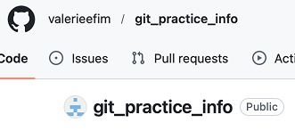
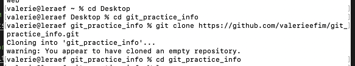
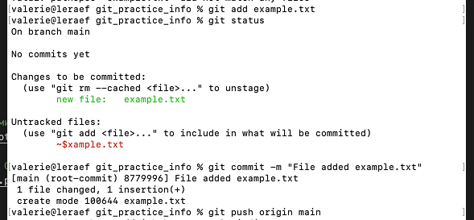
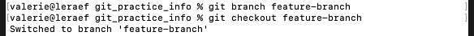
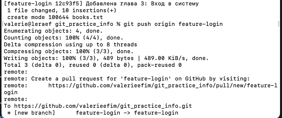
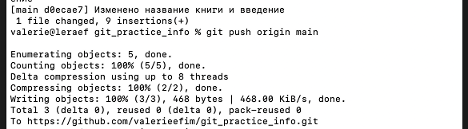
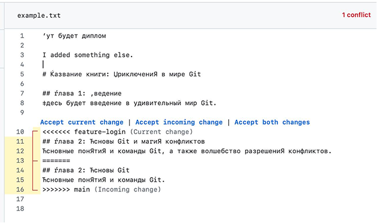
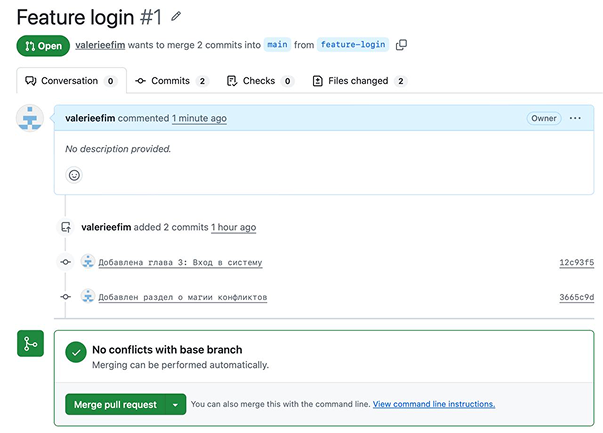

# Лабораторная работа 5

## Git advanced workshop

## Данные о работе

- Студент: Валерия Ефим
- Репозиторий: `git_practice_info`
- URL удаленного репозитория: `https://github.com/valerieefim/git_practice_info.git`
- Основные ветки проекта: `main`, `develop`
- Теги релизов: `v1.0.0`, `v1.0.1`

> Примечание: в рабочем окружении команда `git flow` была недоступна, поэтому этап Git Flow был выполнен эквивалентными стандартными командами Git с сохранением той же логики: `develop -> feature -> release -> hotfix`.

## Цель работы

Освоить продвинутые сценарии работы с Git и GitHub: создание и клонирование репозитория, работу с ветками, моделирование и разрешение конфликтов, автоматизацию проверки файлов перед коммитом и организацию процесса разработки по модели Git Flow.

## Предварительные требования

1. Установленный Git.
2. Учетная запись GitHub.
3. Базовые навыки работы с Git.

## 1. Создание и подготовка репозитория

На GitHub был создан удаленный репозиторий и использован для дальнейшей практики.

### Команды

```bash
git clone https://github.com/valerieefim/git_practice_info.git
cd git_practice_info
```

### Результат

Удаленный репозиторий был успешно подключен как `origin`.

```bash
origin  https://github.com/valerieefim/git_practice_info.git (fetch)
origin  https://github.com/valerieefim/git_practice_info.git (push)
```





## 2. Добавление первого файла и первый коммит

В репозиторий был добавлен файл `example.txt`, после чего изменения были сохранены и отправлены в ветку `main`.

### Команды

```bash
git add example.txt
git commit -m "File added example.txt"
git push origin main
```

### Результат

В истории проекта появился первый коммит:

```bash
8779996 File added example.txt
```


## 3. Работа с веткой feature-branch

Для практики ветвления была создана отдельная ветка `feature-branch`, в которой файл `example.txt` был изменен.

### Команды

```bash
git branch feature-branch
git checkout feature-branch
git add example.txt
git commit -m "File changed example.txt"
git push origin feature-branch
```

### Результат

В истории зафиксирован коммит:

```bash
6c19ee7 File changed example.txt
```

После этого ветка была слита обратно в `main`.

```bash
git checkout main
git merge feature-branch
git push origin main
```


## 4. Работа с веткой feature-login

Для имитации разработки новой функциональности была создана ветка `feature-login`. В файл `books.txt` была добавлена новая глава про вход в систему.

### Команды

```bash
git checkout -b feature-login
git add books.txt
git commit -m "Добавлена глава 3: Вход в систему"
git push origin feature-login
```

### Результат

В истории появился коммит:

```bash
12c93f5 Добавлена глава 3: Вход в систему
```



## 5. Изменения в основной ветке и работа с удаленным репозиторием

Параллельно в ветке `main` были внесены изменения в файл `example.txt`: обновлены название книги и введение, после чего изменения были отправлены в удаленный репозиторий.

### Команды

```bash
git checkout main
git add example.txt
git commit -m "Изменено название книги и введение"
git push origin main
```

### Результат

В истории появился коммит:

```bash
d0ecae7 Изменено название книги и введение
```



## 6. Моделирование и разрешение конфликта

После возвращения в `feature-login` были внесены дополнительные изменения в файл `example.txt`, связанные с главой 2. Это привело к необходимости синхронизации ветки и последующего разрешения конфликта.

### Команды

```bash
git checkout feature-login
git add example.txt
git commit -m "Добавлен раздел о магии конфликтов"
git push origin feature-login
```

### Результат

В истории появился коммит:

```bash
3665c9d Добавлен раздел о магии конфликтов
```

Затем изменения из `feature-login` были интегрированы в `main` через удаленный репозиторий. В истории виден merge-коммит:

```bash
ca9c3e9 Merge pull request
```

Также в удаленной ветке `feature-login` присутствует коммит синхронизации с `main`:

```bash
4bded1c Merge branch 'main' into feature-login
```






## 7. Автоматизация проверки формата файлов при коммите

Для автоматизации проверки файлов перед коммитом был подготовлен скрипт `check_format.sh`, который используется как `pre-commit hook`. Его задача состоит в том, чтобы не допускать попадания в репозиторий `.txt` файлов с некорректным оформлением. Проверка запускается автоматически и не зависит от внимательности пользователя: если в индекс добавлен файл с нарушением формата, Git просто не позволит завершить коммит, пока ошибка не будет исправлена.

В ходе выполнения лабораторной работы был реализован именно такой сценарий. Сначала был создан отдельный shell-скрипт с проверками, затем он был подключен как хук `pre-commit`, после чего каждая попытка сделать коммит сопровождалась автоматическим запуском проверки. Это позволило сразу контролировать качество текстовых файлов, не дожидаясь появления ошибок в удаленном репозитории.

### Что проверяет скрипт

1. Отсутствие CRLF.
2. Отсутствие завершающих пробелов.
3. Отсутствие табуляции.
4. Наличие перевода строки в конце файла.
5. Игнорирование временных файлов вида `~$example.txt`.

### Содержимое скрипта

Файл: `check_format.sh`

```bash
#!/usr/bin/env bash

set -euo pipefail

has_errors=0

while IFS= read -r -d '' file; do
  base_name="$(basename "$file")"

  if [[ "$base_name" == '~$'* ]]; then
    continue
  fi

  tmp_file="$(mktemp)"
  git show ":$file" > "$tmp_file"

  if grep -n $'\r' "$tmp_file" >/dev/null; then
    echo "CRLF line endings found in $file"
    has_errors=1
  fi

  if grep -n '[[:blank:]]$' "$tmp_file" >/dev/null; then
    echo "Trailing whitespace found in $file"
    grep -n '[[:blank:]]$' "$tmp_file"
    has_errors=1
  fi

  if grep -n $'\t' "$tmp_file" >/dev/null; then
    echo "Tab characters found in $file"
    grep -n $'\t' "$tmp_file"
    has_errors=1
  fi

  last_char="$(tail -c 1 "$tmp_file" 2>/dev/null || true)"
  if [[ -s "$tmp_file" && -n "$last_char" ]]; then
    echo "Missing newline at end of file: $file"
    has_errors=1
  fi

  rm -f "$tmp_file"
done < <(git diff --cached --name-only --diff-filter=ACMR -z -- '*.txt')

if [[ "$has_errors" -ne 0 ]]; then
  echo
  echo "Commit aborted. Fix the .txt formatting issues and try again."
  exit 1
fi

echo "TXT format check passed."
```

### Подключение hook

```bash
cp check_format.sh .git/hooks/pre-commit
chmod +x .git/hooks/pre-commit
```

### Результат

После копирования скрипта в каталог `.git/hooks` и выдачи прав на выполнение он начал автоматически запускаться перед каждым коммитом. Проверка анализировала только те `.txt` файлы, которые были добавлены в индекс, то есть именно те изменения, которые пользователь собирался зафиксировать. Это удобнее, чем проверять весь проект целиком, потому что хук работает быстрее и контролирует только актуальные изменения.

Логика работы была следующей:

1. Пользователь изменяет `.txt` файл.
2. Добавляет его в индекс с помощью `git add`.
3. Запускает `git commit`.
4. Перед созданием коммита Git автоматически вызывает `pre-commit`.
5. Если в файле обнаружены CRLF, табуляция, пробелы в конце строки или отсутствует перевод строки в конце файла, коммит прерывается.
6. Если ошибок нет, коммит продолжается в обычном режиме.

Во время практической работы скрипт отрабатывал корректно и при успешной проверке выводил сообщение:

```bash
TXT format check passed.
```

Таким образом, в работе был реализован простой, но полезный механизм локального контроля качества текстовых файлов. Даже без использования сторонних инструментов удалось настроить автоматическую проверку средствами самого Git, что делает процесс коммита более надежным и дисциплинированным.

## 8. Использование Git Flow в проекте

На заключительном этапе лабораторной работы требовалось использовать Git Flow для организации процесса разработки. С первого раза выполнить эту часть по инструкции не удалось, потому что в рабочем окружении команда `git flow` отсутствовала и не скачивалась. Поэтому первая версия этой части задания была выполнена вручную стандартными командами Git: были созданы ветки `develop`, `feature`, `release` и `hotfix`, выполнены коммиты, слияния и постановка тегов.

После этого последовательность действий была дополнительно оформлена уже в логике Git Flow, чтобы показать, как тот же процесс выглядит при использовании соответствующей команды. В отчете отражены сразу две стороны работы: фактически выполненный цикл ветвления средствами обычного Git и его правильное представление в терминах Git Flow.

### 8.1. Подготовка Git Flow

Сначала была предпринята попытка использовать `git flow` напрямую, как это требуется в задании. Однако проверка показала, что команда в системе отсутствует. Из-за этого сразу перейти к работе через `git flow` не получилось.

По этой причине, как указано выше, первая версия задания была выполнена без установленного `git flow`, но с сохранением той же структуры процесса. Иными словами, вместо команды-обертки использовались обычные команды Git, которые приводят к тому же результату: отдельная ветка разработки, отдельная ветка для новой функциональности, подготовка релиза и выпуск срочного исправления.

### 8.2. Первая версия выполнения без git flow

### Команды

```bash
git checkout -b develop
git checkout -b feature/task-management
```

В файл `task_manager.py` был добавлен функционал создания задачи:

```python
def create_task(title, description):
    task = {
        "title": title,
        "description": description,
        "status": "new",
    }
    print(f"Created a new task: {title}")
    return task
```

После этого изменения были зафиксированы:

```bash
git add task_manager.py
git commit -m "Добавлен функционал управления задачами"
```

### Результат

Сначала была создана ветка `develop`, которая использовалась как основная рабочая ветка для дальнейшей разработки. После этого от нее была создана ветка `feature/task-management`, предназначенная для изолированной реализации новой функции.

В рамках этой feature-ветки был добавлен файл `task_manager.py`. В нем реализована простая функция создания задачи: она принимает название и описание, формирует словарь с данными задачи, выводит подтверждающее сообщение и возвращает готовую структуру. 

Коммит фичи:

```bash
e6176b8 Добавлен функционал управления задачами
```

Завершение фичи было выполнено слиянием в `develop`:

```bash
git checkout develop
git merge --no-ff feature/task-management -m "Merge branch 'feature/task-management' into develop"
```

Merge-коммит:

```bash
f676549 Merge branch 'feature/task-management' into develop
```

После завершения работы над функциональностью ветка `feature/task-management` была объединена с `develop` через `merge --no-ff`. Этот способ слияния сохраняет в истории отдельный merge-коммит и позволяет наглядно видеть, что именно в проект был добавлен законченный блок изменений. 

### 8.3. Первая версия выполнения: релиз v1.0.0

### Команды

```bash
git checkout -b release/v1.0.0
echo "v1.0.0" > version.txt
git add version.txt
git commit -m "Обновлена версия для релиза v1.0.0"
```

### Результат

После завершения основной разработки от ветки `develop` была создана ветка `release/v1.0.0`. Назначение такой ветки состоит в том, чтобы подготовить проект к выпуску, не смешивая релизные изменения с продолжением обычной разработки.

В рамках релизной ветки был добавлен файл `version.txt`, в который записано значение `v1.0.0`. Это имитирует типичную релизную задачу: обновление версии, служебных файлов или метаданных перед выпуском новой версии приложения.

Коммит релиза:

```bash
fe0fd6c Обновлена версия для релиза v1.0.0
```

Завершение релиза:

```bash
git checkout main
git merge --no-ff release/v1.0.0 -m "Merge branch 'release/v1.0.0'"
git tag -a v1.0.0 -m "Release v1.0.0"
git checkout develop
git merge --no-ff release/v1.0.0 -m "Merge branch 'release/v1.0.0' into develop"
```

Merge-коммиты:

```bash
00bffbb Merge branch 'release/v1.0.0'
c4e4f28 Merge branch 'release/v1.0.0' into develop
```

После этого релизная ветка была последовательно объединена с `main` и `develop`. Слияние в `main` означает выпуск готовой версии, а слияние обратно в `develop` нужно для того, чтобы релизные изменения не потерялись в основной ветке разработки. Дополнительно для релиза был создан тег `v1.0.0`, который фиксирует конкретную точку в истории проекта и позволяет однозначно определить состояние репозитория на момент выпуска версии.

### 8.4. Первая версия выполнения: hotfix v1.0.1

### Команды

```bash
git checkout main
git checkout -b hotfix/hotfix-1.0.1
git add file_with_error.py version.txt
git commit -m "Исправлена критическая ошибка"
```

### Результат

После выпуска релиза был смоделирован типичный для Git Flow сценарий: обнаружение критической ошибки в уже опубликованной версии. Для такой ситуации используется ветка `hotfix`, которая создается не от `develop`, а от `main`, поскольку исправлять нужно именно текущую рабочую версию.

В рамках ветки `hotfix/hotfix-1.0.1` был добавлен файл `file_with_error.py`, содержащий исправленную функцию `safe_divide`, которая предотвращает деление на ноль. Одновременно файл `version.txt` был обновлен до версии `v1.0.1`, что отражает выпуск исправленной версии.

Коммит hotfix:

```bash
8e626dc Исправлена критическая ошибка
```

Завершение hotfix:

```bash
git checkout main
git merge --no-ff hotfix/hotfix-1.0.1 -m "Merge branch 'hotfix/hotfix-1.0.1'"
git tag -a v1.0.1 -m "Hotfix v1.0.1"
git checkout develop
git merge --no-ff hotfix/hotfix-1.0.1 -m "Merge branch 'hotfix/hotfix-1.0.1' into develop"
```

Merge-коммиты:

```bash
7d9014b Merge branch 'hotfix/hotfix-1.0.1'
9749f8d Merge branch 'hotfix/hotfix-1.0.1' into develop
```

После завершения исправления hotfix был слит в `main`, чтобы обновить стабильную версию проекта, и в `develop`, чтобы ветка разработки также содержала исправление. Для этой версии был создан тег `v1.0.1`. 

### 8.5. Публикация первой версии результата в удаленный репозиторий

### Команды

```bash
git push origin develop main --tags
```

При первой попытке ветка `main` была отклонена, потому что удаленный репозиторий уже содержал новые коммиты:

```bash
! [rejected]        main -> main (fetch first)
```

Для безопасной синхронизации были выполнены дополнительные команды:

```bash
git fetch origin
git checkout main
git merge origin/main -m "Merge remote-tracking branch 'origin/main' into main"
git checkout develop
git merge main -m "Merge branch 'main' into develop"
git push origin main develop
```

### Результат

На этапе публикации возникла типичная практическая ситуация: первая попытка отправить изменения в `main` завершилась отказом, потому что удаленная ветка уже содержала коммиты, которых не было в локальной копии. Это означает, что история локального и удаленного репозитория разошлась, и Git потребовал сначала синхронизировать изменения, а уже потом выполнять отправку.

Для решения этой ситуации были последовательно выполнены `git fetch origin`, затем слияние `origin/main` в локальную ветку `main`, а после этого обновленный `main` был слит в `develop`. 

После синхронизации удалось успешно отправить:

1. Ветку `develop`.
2. Ветку `main`.
3. Теги `v1.0.0` и `v1.0.1`.

Итог успешной отправки:

```bash
To https://github.com/valerieefim/git_practice_info.git
   9749f8d..7abbee2  develop -> develop
   ca9c3e9..4e1f2ce  main -> main
```

### 8.6. Как эта же работа выполняется с git flow

После того как первая версия задания была выполнена вручную, ту же последовательность удобно представить уже в формате команд Git Flow. При установленной утилите работа выглядит более компактно, потому что часть рутинных действий, которые связаны с созданием и завершением служебных веток, берет на себя сама команда `git flow`.

Сначала необходимо инициализировать Git Flow в репозитории:

```bash
git flow init
```

На этапе инициализации Git предлагает выбрать основные ветки. Как правило, в учебном примере используются `main` как ветка стабильной версии и `develop` как ветка основной разработки. После этого можно начать создание новой функциональности:

```bash
git flow feature start task-management
```

Эта команда автоматически создает feature-ветку от `develop` и переключает пользователя в нее. Далее вносятся изменения в `task_manager.py`, после чего они фиксируются обычным способом:

```bash
git add task_manager.py
git commit -m "Добавлен функционал управления задачами"
```

Когда работа над функциональностью завершена, ветка закрывается командой:

```bash
git flow feature finish task-management
```

После этого Git Flow автоматически возвращает пользователя в `develop` и выполняет слияние feature-ветки. Следующим этапом становится подготовка релиза:

```bash
git flow release start v1.0.0
```

В релизной ветке вносятся необходимые изменения, например обновляется версия в файле `version.txt`, после чего создается коммит:

```bash
echo "v1.0.0" > version.txt
git add version.txt
git commit -m "Обновлена версия для релиза v1.0.0"
```

Завершение релиза выполняется командой:

```bash
git flow release finish v1.0.0
```

В результате Git Flow объединяет релиз с `main` и `develop`, а также создает тег версии. Если после выпуска обнаруживается критическая ошибка, создается hotfix:

```bash
git flow hotfix start hotfix-1.0.1
```

После внесения исправления выполняется обычный коммит:

```bash
git add file_with_error.py
git commit -m "Исправлена критическая ошибка"
```

Затем hotfix завершается:

```bash
git flow hotfix finish hotfix-1.0.1
```

На этом этапе Git Flow автоматически объединяет исправление с `main` и `develop`, а также создает новый тег версии. После завершения всех этапов остается отправить результат в удаленный репозиторий:

```bash
git push origin develop
git push origin main
git push --tags
```

Таким образом, работа с `git flow` повторяет ту же самую логику, которая была реализована вручную в первой версии задания, но делает процесс более формализованным и удобным за счет готовых команд для feature-, release- и hotfix-веток.

## 9. Итоговая история проекта

Фрагмент итоговой истории коммитов:

```bash
*   7abbee2 (HEAD -> develop, origin/develop) Merge branch 'main' into develop
|\  
| *   4e1f2ce (origin/main, main) Merge remote-tracking branch 'origin/main' into main
| |\  
| | *   ca9c3e9 Merge pull request #1 from valerieefim/feature-login
| | |\  
| | | *   4bded1c (origin/feature-login) Merge branch 'main' into feature-login
| | | |\  
| | | |/  
| | |/|   
| | | * 3665c9d (feature-login) Добавлен раздел о магии конфликтов
| | | * 12c93f5 Добавлена глава 3: Вход в систему
| * | |   7d9014b (tag: v1.0.1) Merge branch 'hotfix/hotfix-1.0.1'
| |\ \ \  
* | \ \ \   9749f8d Merge branch 'hotfix/hotfix-1.0.1' into develop
|\ \ \ \ \  
| | |/ / /  
| |/| | |   
| * | | | 8e626dc Исправлена критическая ошибка
| |/ / /  
| * | |   00bffbb (tag: v1.0.0) Merge branch 'release/v1.0.0'
| |\ \ \  
| | |/ /  
| |/| |   
* | | |   c4e4f28 Merge branch 'release/v1.0.0' into develop
|\ \ \ \  
| | |/ /  
| |/| |   
| * | | fe0fd6c Обновлена версия для релиза v1.0.0
|/ / /  
* | |   f676549 Merge branch 'feature/task-management' into develop
|\ \ \  
| |/ /  
|/| |   
| * | e6176b8 Добавлен функционал управления задачами
|/ /  
* / d0ecae7 Изменено название книги и введение
|/  
* 6c19ee7 (origin/feature-branch, feature-branch) File changed example.txt
* 8779996 File added example.txt
```

## Вывод

В ходе лабораторной работы были закреплены практические навыки работы с Git и GitHub. Были выполнены операции по созданию и ведению репозитория, работе с ветками, разрешению конфликтов, настройке автоматической проверки `.txt` файлов через `pre-commit` hook, а также моделированию процесса Git Flow с использованием веток `develop`, `feature`, `release` и `hotfix`. В результате проект был успешно синхронизирован с удаленным репозиторием, а история изменений стала наглядной и структурированной.
